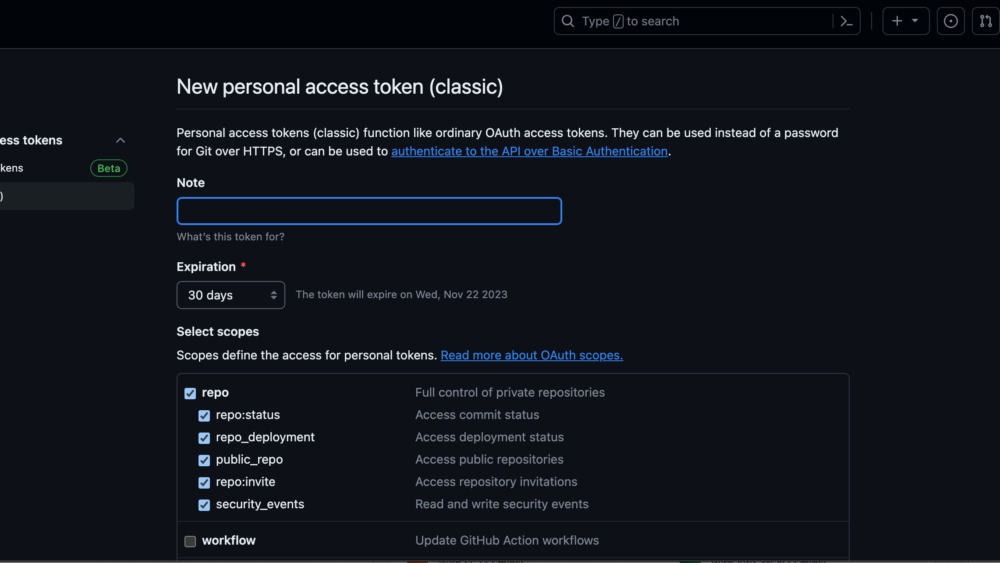
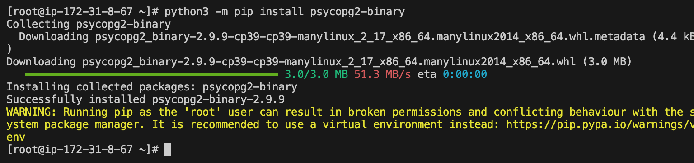
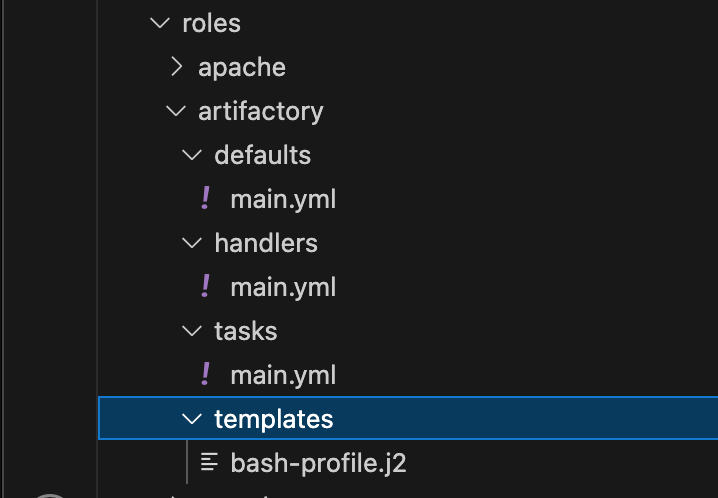
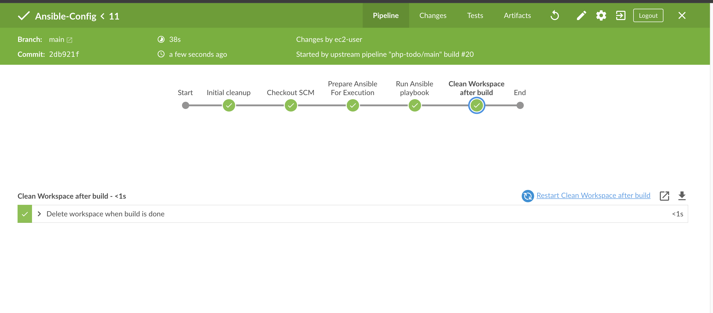
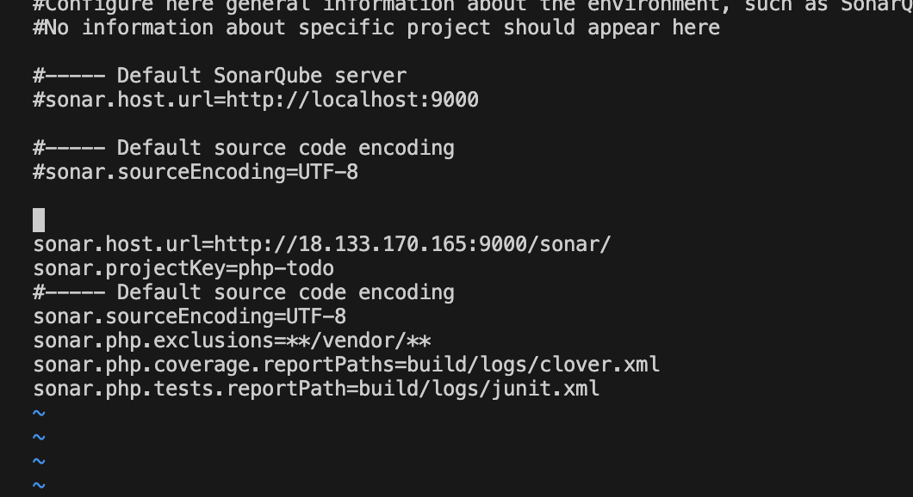

- Moved some files from ansible-config-mgt to the new repo
- Spin up an EC2 red hat and chose t2 medium bcos we need to install Ansible and Jenkins on it 
-  Launch it and connect to it via vs code 
- Install git.. sudo yum install git -y

### Clone ansible-config-mgt 

- Change the directory back to home from Ansible-config .. cd ..
- Switch to the root user using : sudo su -
- Install wget first with: sudo yum install wget -y

- Install Jenkins first from the website: follow d steps
- Choose Linux
- For upgrade; check the dependencies on the GitHub
- The first 2 Commands under dependencies help to install epel and remi repositories

- Install Java from d step

### Open the bash profile with 
  - vi .bash_profile
- To enable bash profile to exporter java path every time we start our instant
- Paste the codes in the bash profile and save

- Reload the bash profile: follow documentation
      source ~/.bash_profile

    

- Exit the root user back to the ec2 user to install Jenkins: exit

- Sudo yum install Jenkins -y

- Start Jenkins with : sudo systemctl start Jenkins
- Enable Jenkins 
- Status Jenkins

- Sudo systemctl daemon-reload

- Public ip with 8080 for Jenkins 

- Configuring Ansible For Jenkins Deployment

- create a folder named depoly inside the ansible-config folder
- create a jenkinsfile inside the folder

Add the code snippet below to start building the Jenkinsfile gradually. This pipeline currently has just one stage called Build and the only thing we are doing is using the shell script module to echo Building Stage

- commit the changes and push to github

- go back to Jenkins dashboard and click on the ansible-config project
- go to configure, under build configuration: under script path
- correct the path to deploy/jenkinsfile to 

- Back to the pipeline,  click build now

- view the pipeline from the blueocean 

 Notice that this pipeline is a multibranch one. This means, if there were more than one branch in GitHub, Jenkins would have scanned the repository to discover them all and we would have been able to trigger a build for each branch.
- Create a new git branch and name it feature/jenkinspipeline-stages
 Currently we only have the Build stage. Let us add another stage called Test. Paste the code snippet below and push the new changes to GitHub.

To make your new branch show up in Jenkins, we need to tell Jenkins to scan the repository.
Navigate to the Ansible project and click on "Scan repository now"

Refresh the page and both branches will start building automatically. You can go into Blue Ocean and see both branches there too.

### Task
1. Create a pull request to merge the latest code into the main branch
2. After merging the PR, go back into your terminal and switch into the main branch.
3. Pull the latest change.
4. Create a new branch, add more stages into the Jenkins file to simulate below phases. (Just add an echo command like we have in build and test stages)
   1. Package 
   2. Deploy 
   3. Clean up
5. Verify in Blue Ocean that all the stages are working, then merge your feature branch to the main branch
6. Eventually, your main branch should have a successful pipeline like this in blue ocean

    //to clean a workspace
        stage("inital cleanup"){
            steps{
                dir("${WORKSPACE}"){
                    deleteDir()
                }
            }
        }

    //final clean
    stage("clean up"){
        steps{
            cleanWs()
        }
    }

### run ansible playbook for Jenkins
- install ansible on jenkins
    sudo yum install ansible -y

  

  -  change to root
      sudo su -

- after that install some dependencies for ansible to work
- for database we need to install ansible-gallaxy  for community.mysql for the roles to work well 
      python3 -m pip install --upgrade setuptools

      python3 -m pip install --upgrade pip

      python3 -m pip install PyMySQL

      python3 -m pip install mysql-connector-python

      python3 -m pip install psycopg2-binary

- install postgress database
      ansible-galaxy collection install community.postgresql

### Installing Ansible plugin in Jenkins UI
- go to to the dashboard
- search for ansible

Creating Jenkinsfile from scratch. (Delete all you currently have in there and start all over to get Ansible to run successfully)
 - create new instances ; nginx - redhat, db- ubuntu

 - exit root user back to ansible config
 - you are doing this inside feature/jenkinspipeline-stages branch

 - create ansible.cfg file inside deploy dir
 inside the cfg file

        [defaults]
        timeout = 160
        callback_whitelist = profile_tasks
        log_path=~/ansible.log
        host_key_checking = False
        gathering = smart
        ansible_python_interpreter=/usr/bin/python3
        allow_world_readable_tmpfiles=true

        [ssh_connection]
        ssh_args = -o ControlMaster=auto -o ControlPersist=30m -o ControlPath=/tmp/ansible-ssh-%h-%p-%r -o ServerAliveInterval=60 -o ServerAliveCountMax=60 -o ForwardAgent=yes

- inside the jenkinsfile

          pipeline {
            agent any

            environment {
                ANSIBLE_CONFIG="${WORKSPACE}/deploy/ansible.cfg"
              }

            parameters {
                string(name: 'inventory', defaultValue: 'dev',  description: 'This is the inventory file for the environment to deploy configuration')
              }

            stages{
                stage("Initial cleanup") {
                    steps {
                      dir("${WORKSPACE}") {
                        deleteDir()
                      }
                    }
                  }

                stage('Checkout SCM') {
                  steps{
                      git branch: 'feature/jenkinspipeline-stages', url: 'https://github.com/Olaminiyi/Ansible-Config.git'
                  }
                }

                stage('Prepare Ansible For Execution') {
                  steps {
                    sh 'echo ${WORKSPACE}' 
                    sh 'sed -i "3 a roles_path=${WORKSPACE}/roles" ${WORKSPACE}/deploy/ansible.cfg'  
                  }
              }

                stage('Run Ansible playbook') {
                  steps {
                    ansiblePlaybook become: true, colorized: true, credentialsId: 'private-key', disableHostKeyChecking: true, installation: 'ansible', inventory: 'inventory/${inventory}', playbook: 'playbooks/site.yml'
                  }
                }

                stage('Clean Workspace after build'){
                  steps{
                    cleanWs(cleanWhenAborted: true, cleanWhenFailure: true, cleanWhenNotBuilt: true, cleanWhenUnstable: true, deleteDirs: true)
                  }
                }
            }

          }

### to get your ansible pplaybook
- from dashboard/manage jenkins/credentials
- click on globals, click on add credentials
- cat your pem key and paste it

    
    
    

 
- to configure ansibe, go back to dashboard, click on tool configuration
- scroll to add ansible
        - name : ansible
        - path : /usr/bin

    

- go back to pipeline syntax; select ansible playbook: invoke an ansblie playbook

    
    
    

### Parameterizing Jenkinsfile For Ansible Deployment
To deploy to other environments, we will need to use parameters.

- create new 2 instances for nginx and the database 

  
    
- update the dev.yml with the new instances private ip addresses

    

- refrence the new instatnces in the site.yml file

    

- create and update nginx.yaml file under static assignment

    

### Update Jenkinsfile to introduce parameterization. Below is just one parameter. It has a default value in case if no value is specified at execution. It also has a description so that everyone is aware of its purpose.
- make the parameterization global

- for parameterazation to work, we will reference our inventory as a parameter in the ansible playbook

- build the main branch with parameters

### CI/CD Pipeline for TODO application

- Fork the repository below into your GitHub account
   https://github.com/darey-devops/php-todo.git

### clone the repo on the jenkins server
- cd out from the ansible config directory to the main server, i.e 
      cd ..
- clone the repo on the jenkins server

- add the todo folder to the work space

### On you Jenkins server, install PHP, its dependencies and Composer tool (Feel free to do this manually at first, then update your Ansible accordingly later)
    - change to sudo user : 
    sudo su -

        yum module reset php -y
        yum module enable php:remi-7.4 -y
        yum install -y php php-common php-mbstring php-opcache php-intl php-xml php-gd php-curl php-mysqlnd php-fpm php-json
        systemctl start php-fpm
        systemctl enable php-fpm

  

### install composer tool
        curl -sS https://getcomposer.org/installer | php
        sudo mv composer.phar /usr/bin/composer

 - Verify Composer is installed or not
        composer --version
    

### Install plot plugins (from manage jenkins to plugins)
We will use plot plugin to display tests reports, and code coverage information.
The Artifactory plugin will be used to easily upload code artifacts into an Artifactory server.
- Plot plugin

- Artifactory plugin

- create the artifact roles
- spin up an ec2 instance for artifact

- configure the roles for artifact

- create artifact.yml file under static-assignment and reference inside the site yml

- run the site.yml against the ci to install artifactory
   

- access the the artifactory using the public id @ port 8081
- open up port 8081 and 8082 on the artifactory security group
  

- create a repository

### reposiory key is generic-local

- fom the jenkins dashboard go to system configuration
- scroll down down to jfrog artifactory
- instance ID - artifactory-server
- jfrom platform url is the http url address - http://18.168.197.203:8081/ 

    

 - click on test connection
   
  

### integrate arifactory repository with jenkins
Because our todo app new a database to run, we need need to create a database for it from the mysql inside roles
- create a new user using 
    Create database homestead;
                CREATE USER 'homestead'@'%' IDENTIFIED BY 'sePret^i';
                GRANT ALL PRIVILEGES ON * . * TO 'homestead'@'%';

- the ip address must be the private ip address of the jenkins server
  
  
  
- run the ansible playbook to against dev to create the new database

- check on the database server if the database has been created

- create a database and username (homestead) with the Jenkins's private ip address
- run dev against site.yml to create the new database and user
- you can connect through ssh using the db server to check if the database and the user was created sucessfully

 
 

### Notice the Prepare Dependencies section
- The required file by PHP is .env so we are renaming .env.sample to .env
- Composer is used by PHP to install all the dependent libraries used by the application
- php artisan uses the .env file to setup the required database objects – (After successful run of this step, login to the database, run show tables and you will see the tables being created for you)

- Using Blue Ocean, create a multibranch Jenkins pipeline to create todo pipeine
- go back to the dashboard and click on blueocean, click on new pipeline

  

- Create a  Jenkinsfile in the repository
-
  
#### our jenkinn is acting as mysql client in this project
- we need to install mysql-client on the jenkins in the php-todo directory
       sudo yum install mysql
    
   
- ssh into the db server 
     sudo vi /etc/mysql/mysql.conf.d/mysqld.cnf

- and set the bind address into 0.0.0.0

    

- restart mysql and check the status

    

- update the .env file inside the php-todo directory
- change the ip address to the ip address of the database
- Add these 2 lines  DB_CONNECTION=mysql and DB_PORT=3306 under the DB settings
      

- then connect to the db database from the jenkins server
- mysql -h (db private ip address) -u (username ) -p .... press enter to enter the password
       mysql -h 172.31.11.102 -u homestead -p
- or you ssh into the db from Jenkins server using
         ssh -A ubuntu@<public ip address>
         ssh @ubuntu/ec2-user@<Private ip address>

### Update the Jenkinsfile to include Unit tests step 
        stage('Execute Unit Tests') {
          steps {
          sh './vendor/bin/phpunit'
              }
        }
  
  
  

# Phase 3 – Code Quality Analysis
- For PHP the most commonly tool used for code quality analysis is phploc.
- for more The data produced by phploc can be ploted onto graphs in Jenkins.

### install phpploc 
- cd .. out to the root folder
        sudo dnf --enablerepo=remi install php-phpunit-phploc
        wget -O phpunit https://phar.phpunit.de/phpunit-7.phar
        chmod +x phpunit
      

 

- Add the code analysis step in Jenkinsfile. The output of the data will be saved in build/logs/phploc.csv file.
        stage('Code Analysis') {
          steps {
            sh 'phploc app/ --log-csv build/logs/phploc.csv'
          }
      }

 

- next stage is to plot the data using the jenking plot plug

              stage('Plot Code Coverage Report') { steps {

                  plot csvFileName: 'plot-396c4a6b-b573-41e5-85d8-73613b2ffffb.csv', csvSeries: [[displayTableFlag: false, exclusionValues: 'Lines of Code (LOC),Comment Lines of Code (CLOC),Non-Comment Lines of Code (NCLOC),Logical Lines of Code (LLOC)', file: 'build/logs/phploc.csv', inclusionFlag: 'INCLUDE_BY_STRING', url: '']], group: 'phploc', numBuilds: '100', style: 'line', title: 'A - Lines of code', yaxis: 'Lines of Code'
                  plot csvFileName: 'plot-396c4a6b-b573-41e5-85d8-73613b2ffffb.csv', csvSeries: [[displayTableFlag: false, exclusionValues: 'Directories,Files,Namespaces', file: 'build/logs/phploc.csv', inclusionFlag: 'INCLUDE_BY_STRING', url: '']], group: 'phploc', numBuilds: '100', style: 'line', title: 'B - Structures Containers', yaxis: 'Count'
                  plot csvFileName: 'plot-396c4a6b-b573-41e5-85d8-73613b2ffffb.csv', csvSeries: [[displayTableFlag: false, exclusionValues: 'Average Class Length (LLOC),Average Method Length (LLOC),Average Function Length (LLOC)', file: 'build/logs/phploc.csv', inclusionFlag: 'INCLUDE_BY_STRING', url: '']], group: 'phploc', numBuilds: '100', style: 'line', title: 'C - Average Length', yaxis: 'Average Lines of Code'
                  plot csvFileName: 'plot-396c4a6b-b573-41e5-85d8-73613b2ffffb.csv', csvSeries: [[displayTableFlag: false, exclusionValues: 'Cyclomatic Complexity / Lines of Code,Cyclomatic Complexity / Number of Methods ', file: 'build/logs/phploc.csv', inclusionFlag: 'INCLUDE_BY_STRING', url: '']], group: 'phploc', numBuilds: '100', style: 'line', title: 'D - Relative Cyclomatic Complexity', yaxis: 'Cyclomatic Complexity by Structure'      
                  plot csvFileName: 'plot-396c4a6b-b573-41e5-85d8-73613b2ffffb.csv', csvSeries: [[displayTableFlag: false, exclusionValues: 'Classes,Abstract Classes,Concrete Classes', file: 'build/logs/phploc.csv', inclusionFlag: 'INCLUDE_BY_STRING', url: '']], group: 'phploc', numBuilds: '100', style: 'line', title: 'E - Types of Classes', yaxis: 'Count'
                  plot csvFileName: 'plot-396c4a6b-b573-41e5-85d8-73613b2ffffb.csv', csvSeries: [[displayTableFlag: false, exclusionValues: 'Methods,Non-Static Methods,Static Methods,Public Methods,Non-Public Methods', file: 'build/logs/phploc.csv', inclusionFlag: 'INCLUDE_BY_STRING', url: '']], group: 'phploc', numBuilds: '100', style: 'line', title: 'F - Types of Methods', yaxis: 'Count'
                  plot csvFileName: 'plot-396c4a6b-b573-41e5-85d8-73613b2ffffb.csv', csvSeries: [[displayTableFlag: false, exclusionValues: 'Constants,Global Constants,Class Constants', file: 'build/logs/phploc.csv', inclusionFlag: 'INCLUDE_BY_STRING', url: '']], group: 'phploc', numBuilds: '100', style: 'line', title: 'G - Types of Constants', yaxis: 'Count'
                  plot csvFileName: 'plot-396c4a6b-b573-41e5-85d8-73613b2ffffb.csv', csvSeries: [[displayTableFlag: false, exclusionValues: 'Test Classes,Test Methods', file: 'build/logs/phploc.csv', inclusionFlag: 'INCLUDE_BY_STRING', url: '']], group: 'phploc', numBuilds: '100', style: 'line', title: 'I - Testing', yaxis: 'Count'
                  plot csvFileName: 'plot-396c4a6b-b573-41e5-85d8-73613b2ffffb.csv', csvSeries: [[displayTableFlag: false, exclusionValues: 'Logical Lines of Code (LLOC),Classes Length (LLOC),Functions Length (LLOC),LLOC outside functions or classes ', file: 'build/logs/phploc.csv', inclusionFlag: 'INCLUDE_BY_STRING', url: '']], group: 'phploc', numBuilds: '100', style: 'line', title: 'AB - Code Structure by Logical Lines of Code', yaxis: 'Logical Lines of Code'
                  plot csvFileName: 'plot-396c4a6b-b573-41e5-85d8-73613b2ffffb.csv', csvSeries: [[displayTableFlag: false, exclusionValues: 'Functions,Named Functions,Anonymous Functions', file: 'build/logs/phploc.csv', inclusionFlag: 'INCLUDE_BY_STRING', url: '']], group: 'phploc', numBuilds: '100', style: 'line', title: 'H - Types of Functions', yaxis: 'Count'
                  plot csvFileName: 'plot-396c4a6b-b573-41e5-85d8-73613b2ffffb.csv', csvSeries: [[displayTableFlag: false, exclusionValues: 'Interfaces,Traits,Classes,Methods,Functions,Constants', file: 'build/logs/phploc.csv', inclusionFlag: 'INCLUDE_BY_STRING', url: '']], group: 'phploc', numBuilds: '100', style: 'line', title: 'BB - Structure Objects', yaxis: 'Count'

            }
          }

- from the Jenkins, goto main under php-todo

### Bundle the application code for into an artifact (archived package) upload to Artifactory
- install zip first
     sudo yum install zip -y

- add the 2 stages to the jenkins file inside php-todo
- pack artifact stage
- upload artifact into artifactory stage

- Deploy the application to the dev environment
- cd into the Ansible Config directory
- spin up a new ec2 redhat server named todo-server
  

  
- add the todo private ip address to the dev environment
  

- under static assignmet: create deployment.yml file
- under downloading artifact; ensure the username and password of the artifact i.e (jfrog) login are corret
- ensure the url to you uploaded the php-todo earlier in the previous stage is correct as well

- import it under the site.yml
  

- To run the playbook from the jenkins
- open both Ansible-Conf and php-todo in separate windows in blue ocean
- buid the php-todo job it will trigger the Ansible job to complete the job. 
- this will install all do the installation in the deployment.yml file on the todo server, download the project from the artifactory and deploy it into the Dev environment.

    
    

- to get the password inside the deployment.yml encrypted
    - click on set me up on the Jfro atifactory php-todo page
    - enter the password to generate an encrypted password
    - copy it and put it inplace of the url password 
   
   
  

- To check if our application was successfully downloaded
    - copy the public ip of the todo-server and paste into the web browser
 
    

But how are we certain that the code being deployed has the quality that meets corporate and customer requirements? Even though we have implemented Unit Tests and Code Coverage Analysis with phpunit and phploc, we still need to implement Quality Gate to ensure that ONLY code with the required code coverage, and other quality standards make it through to the environments.

### To achieve this, we need to configure SonarQube

- spin up a new ubuntu server for sonaqube using t2 medium

- add sonaqube role

- added sonarqube to the ci environment!

[Alt text](images/14.104.png)

- run the ansible playbook from the Ansible Config( buil with parameter using CI)

- open port 9000 on the sonarqube server

- using the public Ip address of sonarqube, paste on the url with port 9000/sonar 
  18.133.140.146:9000/sonar or localhost:9000
   
   

- Login to the sonarqube with default (username  and password) = admin

### CONFIGURE SONARQUBE AND JENKINS FOR QUALITY GATE
- In Jenkins, install SonarScanner plugin
- from the manage jenkings > plugins - search for sonar
  
  

- Navigate to configure system in Jenkins. Add SonarQube server as shown below:
  - manange jenkins > configure server
  - put the name as Sonarqube
  - put the url link to the website http://18.133.140.146:9000/sonar
  
  

- Generate authentication token in SonarQube
     User > My Account > Security > Generate Tokens
     
                  
  
- Configure Quality Gate Jenkins Webhook in SonarQube – The URL should point to your Jenkins server 
       http://{JENKINS_HOST}/sonarqube-webhook/  
   Administration > Configuration > Webhooks > Create

- Setup SonarQube scanner from Jenkins – Global Tool Configuration 
 Manage Jenkins > Global Tool Configuration

- Update Jenkins Pipeline to include SonarQube scanning and Quality Gate
- inside the php-todo jenkins file
- normally this step should come before packing artifacts

### [for java version error: you can install another verion and use sudo alternatives --config java to switch between the version]

### if you get this error - ERROR: You must define the following mandatory properties for 'Unknown': sonar.projectKey

## NOTE: The above step will fail because we have not updated `sonar-scanner.properties
Configure sonar-scanner.properties – From the step above, Jenkins will install the scanner tool on the Linux server. You will need to go into the tools directory on the server to configure the properties file in which SonarQube will require to function during pipeline execution.

- cd /var/lib/jenkins/tools/hudson.plugins.sonar.SonarRunnerInstallation/SonarQubeScanner/conf/ 
- Open sonar-scanner.properties file with vi
- sudo vi sonar-scanner.properties
- Add configuration related to php-todo project 

        sonar.host.url=http://<SonarQube-Server-IP-address>:9000
        sonar.projectKey=php-todo
        #----- Default source code encoding
        sonar.sourceEncoding=UTF-8
        sonar.php.exclusions=**/vendor/**
        sonar.php.coverage.reportPaths=build/logs/clover.xml
        sonar.php.tests.reportPath=build/logs/junit.xml

# i added this line to the sonar scanner property
        sonar.sources=/var/lib/jenkins/workspace/php-todo_main
 - because the error from the  showed that the source to the projectKey wasn't specified.

# for more information on sonaqube
- https://docs.sonarsource.com/sonarqube/latest/analyzing-source-code/scanners/jenkins-extension-sonarqube/

The quality gate we just included has no good effect on the development because if you go to the SonarQube UI, you will realise that we just pushed a poor-quality code onto the development environment.
Though there are no bugs but there is 0.0% code coverage. (code coverage is a percentage of unit tests added by developers to test functions and objects in the code)

- If you click on php-todo project for further analysis, there is 6 hours’ of technical debt, code smells and security issues in the code.

### In the development environment, this is acceptable as developers  need to do unit testing on their code try to refactor their code towards perfection. But as a DevOps engineer working on the pipeline, we must ensure that the quality gate step causes the pipeline to fail if the conditions for quality are not met. To achieve this we'll have to edit our Jenkinsfile.

        stage('SonarQube Quality Gate') {
              when { branch pattern: "^develop*|^hotfix*|^release*|^main*", comparator: "REGEXP"}
                environment {
                    scannerHome = tool 'SonarQubeScanner'
                }
                steps {
                    withSonarQubeEnv('sonarqube') {
                        sh "${scannerHome}/bin/sonar-scanner -Dproject.settings=sonar-project.properties"
                    }
                    timeout(time: 1, unit: 'MINUTES') {
                        waitForQualityGate abortPipeline: true
                    }
                }
            }

 

### if you run this on the Jenkins server, you will notice that the job will not be able to deploy to the environment because of the code smell and the bad code coverage. The devops engineer will push the code back to the developer to work on it. Once everything is good with code quality, the pipeline will pass and proceed with sipping the codes further to a higher environment.

### Configure Jenkins Slave
- spin up a new RedHat EC2 named it Jenkins Slave

- install Java
        sudo yum install java-11-openjdk-devel -y

- update  the bash profile 
      sudo -i
      vi .bash_profile

      export JAVA_HOME=$(dirname $(dirname $(readlink $(readlink $(which java)))))
      export PATH=$PATH:$JAVA_HOME/bin 
      export CLASSPATH=.:$JAVA_HOME/jre/lib:$JAVA_HOME/lib:$JAVA_HOME/lib/tools.jar

- Reload the bash Profile
      source ~/.bash_profile

- on the Jenkins - manage Jenkins > Nodes

- click on New Nodes

- Give the new node Agent 1 and check the permanent Agent box

- use the private ip address of the Jenkins- slave as the host

- the agent is configured successfully and can talk to each other

### To set up a webhook for the project
- go to php repository
- click on setting
 click on webhook > add webhook
- add the url of the Jenkins server http://18.134.158.234:8080/github-webhook/

